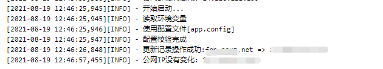

# ddns-dnspod

动态 DNS 服务镜像，用于检测 IP 变化并更新至 [DNSPod](https://www.dnspod.cn/)

[DockerHub](https://hub.docker.com/r/neuzz/ddns-dnspod) | [GitHub](https://github.com/Neuz/Dockerfiles/tree/main/ddns-dnspod)

---

    

---

 [中文文档](README.md) | [ENGLISH](README_en.md)

---



## 内容列表

- [ddns-dnspod](#ddns-dnspod)
  - [内容列表](#内容列表)
  - [用法](#用法)
    - [环境变量方式](#环境变量方式)
    - [配置文件方式](#配置文件方式)
  - [更新日志](#更新日志)
  - [维护人员](#维护人员)
  - [相关](#相关)
  - [许可](#许可)

## 用法

配置项支持 ***环境变量*** 以及 ***配置文件*** 两种方式

### 环境变量方式

环境变量说明：

```
# DNSPod API 密钥中的 ID
DNSPOD_ID=123456

# DNSPod API 密钥中的 Token
DNSPOD_TOKEN=123456

# 需要更新的顶级域名
DOMAIN=example.com

# 需要更新的子域名，如：www、sub，如果是根域名，直接填 @
SUB_DOMAIN=example

# 更新间隔时间（秒），不允许小于30秒
INTERNAL=50

# 邮箱
EMAIL=example@example.com
```

运行docker

```
docker run -dit \
    -e DNSPOD_ID=123456 \
    -e DNSPOD_TOKEN=123456 \
    -e DOMAIN=example.com \
    -e SUB_DOMAIN=example \
    -e INTERNAL=50 \
    -e EMAIL=example@example.com \
    neuzz/ddns-dnspod:latest
```

### 配置文件方式

配置文件 `app.config` 说明：

```
[cfg]
# DNSPod API 密钥中的 ID
dnspod_id = 123456

# DNSPod API 密钥中的 Token
dnspod_token = 123456

# 需要更新的顶级域名
domain = example.com

# 需要更新的子域名，如：`www`、`sub`，如果是根域名，填`@`
sub_domain = example

# 更新间隔时间（秒），不允许小于30秒
internal = 50

# 邮箱
email = example@example.com
```

运行docker

```
docker run -dit \
    -v <YOUR_CONFIG_FILE>:/app/app.config \
    neuzz/ddns-dnspod:latest
```

## 更新日志

- `latest` 为最新版
- `Tags` 为历史版本

## 维护人员

- [viacooky](https://github.com/viacooky)

## 相关

- [DNSPOD 密钥管理文档](https://docs.dnspod.cn/account/5f2d466de8320f1a740d9ff3/)
- [scofieldpeng/dnspod-ddns](https://github.com/scofieldpeng/dnspod-ddns)

## 许可

[MIT License](../LICENSE) © 2021 Neuz