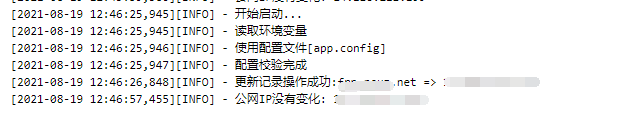

# ddns-dnspod

Dynamic DNS service image to detect IP changes and update to [DNSPod](https://www.dnspod.cn/)

[DockerHub](https://hub.docker.com/r/neuznet/ddns-dnspod) | [GitHub](https://github.com/Neuz/Dockerfiles/tree/main/ddns-dnspod)

---

   

---

 [中文文档](README.md) | [ENGLISH](README_en.md)

---



## Table of Contents

- [ddns-dnspod](#ddns-dnspod)
  - [Table of Contents](#table-of-contents)
  - [Usage](#usage)
    - [Environment variable](#environment-variable)
    - [Configuration file](#configuration-file)
  - [Changelog](#changelog)
  - [Maintainers](#maintainers)
  - [Related](#related)
  - [License](#license)

## Usage

configuration support ***Environment variable*** and ***Configuration file*** two ways.

### Environment variable

Environment variable definition:

```
# DNSPod API ID
DNSPOD_ID=123456

# DNSPod API Token
DNSPOD_TOKEN=123456

# need to update domain
DOMAIN=example.com

# need to update subdomain, example：www、sub, if root domain, use @
SUB_DOMAIN=example

# update interval time(Seconds), need greater than 30 seconds
INTERNAL=50

# email
EMAIL=example@example.com
```

docker run

```
docker run -dit \
    -e DNSPOD_ID=123456 \
    -e DNSPOD_TOKEN=123456 \
    -e DOMAIN=example.com \
    -e SUB_DOMAIN=example \
    -e INTERNAL=50 \
    -e EMAIL=example@example.com \
    neuznet/ddns-dnspod:latest
```

### Configuration file

Configuration file `app.config` definition

```
[cfg]
# DNSPod API ID
dnspod_id = 123456

# DNSPod API Token
dnspod_token = 123456

# need to update domain
domain = example.com

# need to update subdomain, example：www、sub, if root domain, use @
sub_domain = example

# update interval time(Seconds), need greater than 30 seconds
internal = 50

# email
email = example@example.com
```

docker run

```
docker run -dit \
    -v <YOUR_CONFIG_FILE>:/app/app.config \
    neuznet/ddns-dnspod:latest
```

## Changelog

- `latest` - latest version

- `0.0.3` --- 2021-10-09

  ```
  1. Code optimization, output information optimization
  ```

- `0.0.2` --- 2021-08-20
  ```
  1. Remove the verification limit of the minimum interval of 3 seconds, which is managed by the user
  2. add domain record cache, reacquire when timeout 10 minutes
  ```

## Maintainers

- [viacooky](https://github.com/viacooky)

## Related

- [DNSPOD API](https://www.dnspod.cn/docs/index.html)
- [DNSPOD Token Document](https://docs.dnspod.cn/account/5f2d466de8320f1a740d9ff3/)
- [scofieldpeng/dnspod-ddns](https://github.com/scofieldpeng/dnspod-ddns)

## License

[MIT License](../LICENSE) © 2021 Neuz